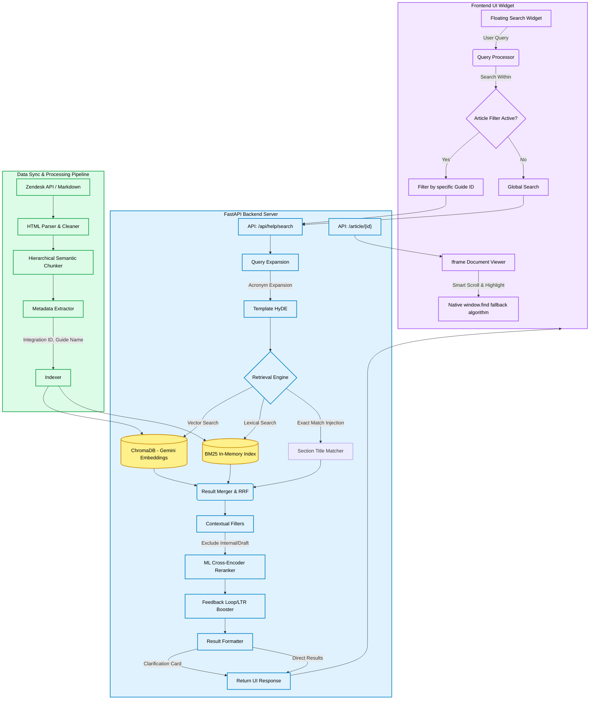

# Aquera Help Center - AI Search Architecture

This document provides a comprehensive overview of the Aquera AI Help Center architecture. It is designed to provide state-of-the-art (SOTA) hierarchical search capabilities specifically tailored for complex, multi-section integration guides.

## High-Level Architecture Diagram

---

## 1. Data Ingestion & Processing Pipeline
The foundation of the architecture relies on converting complex, heavily formatted Zendesk HTML documents into clean, hierarchical chunks.
* **Source:** Zendesk API (`sync_category.py`) or Local Markdown files (`local_ingest.py`).
* **Hierarchical Chunker:** Uses `BeautifulSoup` to parse HTML, preserving heading boundaries (`<h1>`, `<h2>`, `<h3>`). It maps every paragraph to its parent "Guide" and "Section", creating highly contextualized semantic blocks.
* **Metadata Extraction:** Automatically tags chunks with their `integration_id`, `article_id`, `article_title`, and product versions.

## 2. Dual-Index Retrieval Engine
Unlike standard RAG pipelines that rely solely on vector search, this system uses a hybrid retrieval engine for maximum recall:
* **Vector Search (ChromaDB):** Uses Gemini Dense Embeddings to find conceptually similar text (e.g., "how to add users" matching "user provisioning").
* **Lexical Search (BM25):** An in-memory statistical index that excels at exact keyword matches (e.g., specific error codes, specific product names).
* **Exact Lexical Injection:** A custom heuristic that instantly boosts a chunk to the #1 position (`score: 1000.0`) if the user's query exactly matches a section title, heavily prioritizing direct navigation.
* **Template HyDE:** "Hypothetical Document Expansion". Expands queries locally without LLM latency (e.g., converting "Overview" into "To configure Overview, navigate to the integration settings...").

## 3. Reranking & Feedback Loop
Retrieval ensures we find the needle in the haystack, but reranking ensures it's placed at the very top.
* **ML Cross-Encoder (`reranker.py`):** Uses a pre-trained `ms-marco-MiniLM` model. It takes the top combined results from Vector and Lexical search and scores them based on deep semantic relationship, effectively re-ordering the list with incredible accuracy.
* **LTR (Learning to Rank) / Feedback Loop:** Listens to user interactions (clicks, feedback buttons). If a user frequently clicks a specific guide for a specific query, the system permanently boosts that guide for future similar searches.
* **Contextual Filters:** Strictly enforces UI constraints (like `article_filter` for the "Search Within" feature) and scrubs out internal draft documents or "Do Not Publish" markers.

## 4. Frontend UI & Intelligent Viewer
A vanilla JS floating widget that provides a seamless user experience.
* **Clarification Engine:** If a search is too generic (e.g., "Exceptions Details View") and returns multiple valid sections, the backend returns a `clarification_needed` flag. The UI renders dynamic chips (e.g., "Prerequisites", "Troubleshooting") to guide the user.
* **Iframe Smart Highlighter:** When a user clicks "Read Section", the UI opens the full Zendesk article in an iframe. It uses a custom cascading javascript algorithm built around `window.find()` to locate the exact paragraph in the rendered DOM (dynamically handling unexpected HTML tags or bullet points) and snaps the user directly to the answer with a yellow highlight.
